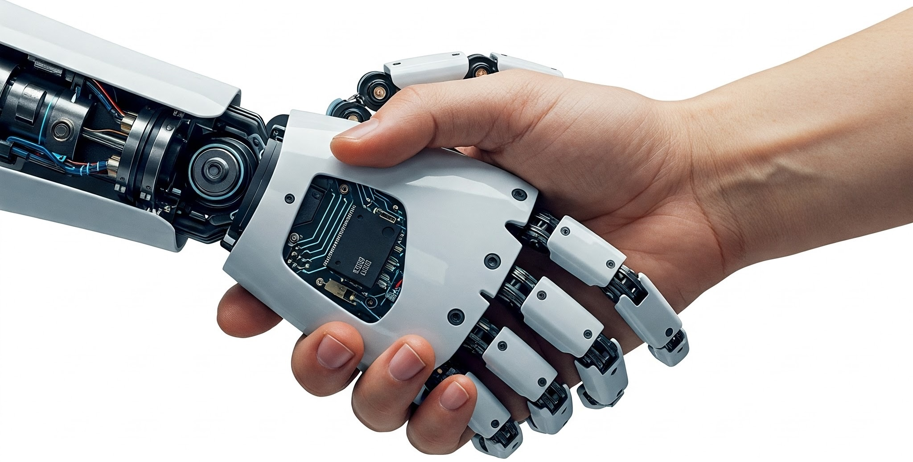

# Human-Agent Negotiation Interface (HANI)



HANI is a web-based interface for conducting negotiations between humans and AI agents. It provides a rich set of tools for analyzing negotiation dynamics, making offers, and understanding your negotiation partner's behavior.

## Key Features

<div class="grid cards" markdown>

-   :material-handshake:{ .lg .middle } __Interactive Negotiation__

    ---

    Engage in turn-based negotiations with AI agents using an intuitive web interface

-   :material-robot:{ .lg .middle } __AI-Powered Tools__

    ---

    Extract offers from text, generate responses, and get strategic suggestions

-   :material-chart-line:{ .lg .middle } __Analysis Tools__

    ---

    Visualize utilities, track negotiation history, and understand preferences

-   :material-cog:{ .lg .middle } __Flexible Configuration__

    ---

    Support for multiple authentication modes, custom scenarios, and agent types

</div>

## Quick Start

### 1. Install HANI

```bash
pip install hani
```

### 2. Initialize Configuration

```bash
hani setup
```

### 3. Start the Application

```bash
hani
```

Then open your browser to [http://localhost:5006](http://localhost:5006) and log in with the default credentials:

- **Username:** `admin` or `user`
- **Password:** `adminpass` or `userpass`

## Next Steps

- [Installation Guide](installation.md) - Detailed installation instructions
- [Quick Start Guide](quickstart.md) - Get up and running quickly
- [Authentication](authentication.md) - Configure authentication for your needs
- [Defining Scenarios](scenarios.md) - Create custom negotiation scenarios

## License

HANI is released under the GNU Affero General Public License v3 (AGPL-3.0).

## Author

Created by [Yasser Mohammad](mailto:yasserfarouk@gmail.com)
